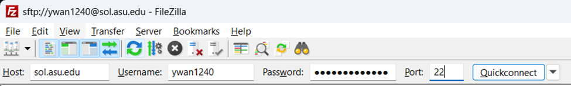
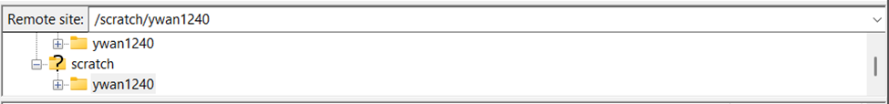
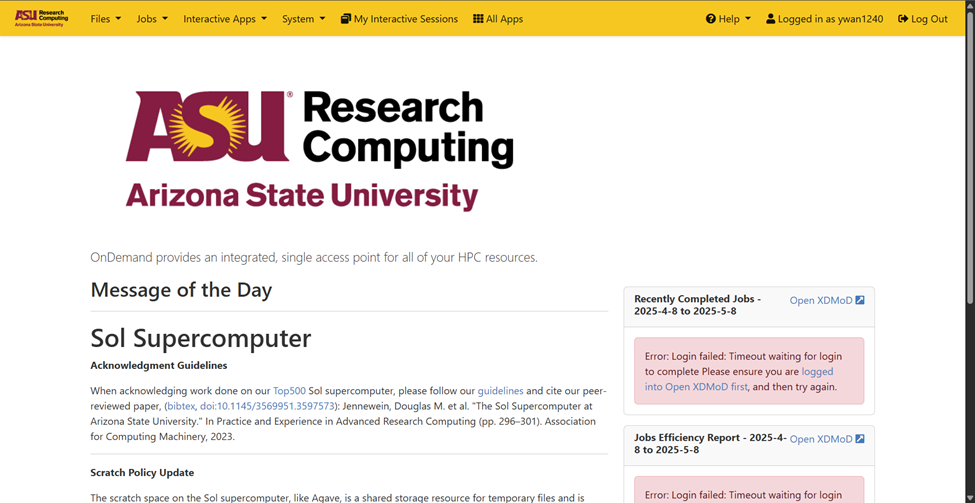
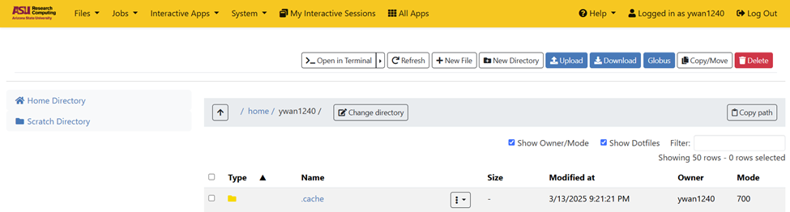
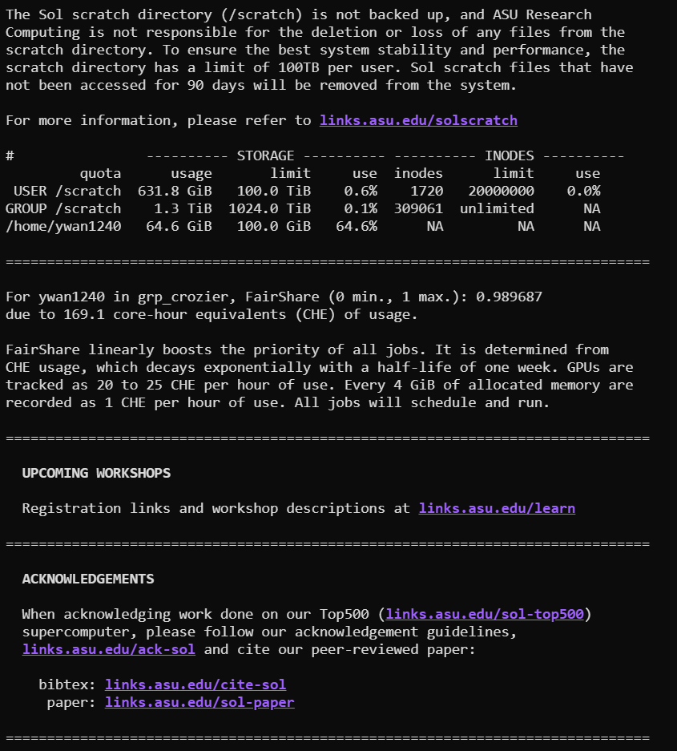
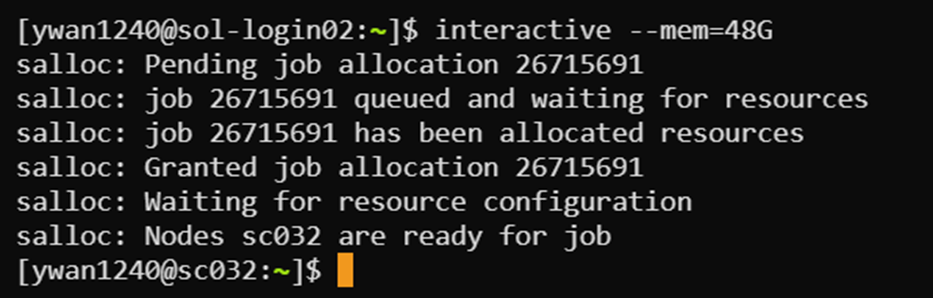
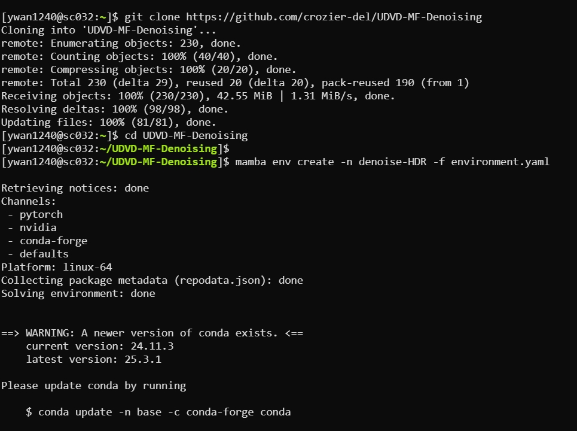
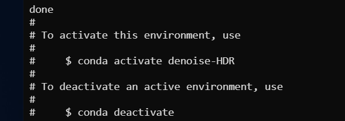
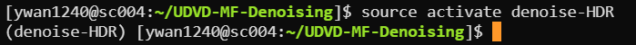

# UDVD Setup Guide for ASU Sol
## Software Preparation *(Optional)*
Install the following software:

- FileZilla
- Cisco AnyConnect*

\* *Required when accessing the supercomputer off campus.*

FileZilla is the software we can use to upload and fetch files from supercomputer storage. To access, type in the following information:

>Host: sol.asu.edu
>
>Username: ASURITE ID
>
>Password: ASURITE Password
>
>Port: 22



Then click the `Quickconnect` button. Click Yes for all the popped-out dialogues. On the right side of the window, the home directory will appear. The home directory has a limit of 100 GB storage limit. It is recommended to put all the code in the home directory, and all the data in scratch directory.

To enter the scratch directory, change the address of remote site to `/scratch/ASURITE ID`



Remember that periodically the files in the scratch directory get deleted so after the job is completed, remove the files from the scratch directory and download it elsewhere.

## Setting up the Denoising Environment
### [Accessing the Sol Supercomputer](#accessing-the-sol-supercomputer)

Go to this website: [https://ood04.sol.rc.asu.edu/pun/sys/dashboard](https://ood04.sol.rc.asu.edu/pun/sys/dashboard)



Click on `Files`  →  `Home directory`



Click on `Open in Terminal`. A new window of command lines will pop up.



Now we have successfully accessed the supercomputer.

### Run an Interactive Session

The installation process needs a certain amount of memory and running time. It is required by ASU Research Computing team to run this through a so-called interactive session, which is basically a job.

To activate an interactive session with 4 cores and 64GB of memory, enter following command in the command window:

```Shell
interactive -c 4 --mem=64G
```

It will put this job of interactive session into queue. But normally the queueing time is pretty short. Here we show a case of starting an interactive session only with 1 core and 48GB of memory.



Now we are in an interactive session.

### Setting up the Environment

First we need to activate mamba. Run: 
```shell
module load mamba/latest
```

Now we can pull all the files we need from GitHub. Run the following command to retrieve all the files.

```Shell
git clone https://github.com/crozier-del/UDVD-MF-Denoising
``` 

The packages needed for the environment is written in the `environment.yaml` file. To use that, we need to run following commands:

```Shell
cd UDVD-MF-Denoising
mamba env create -n denoise-HDR -f environment.yaml
```



The installation might take a while. Sit back and relax.



To test whether the environment is successfully installed, we can run following command. 

``` Shell
source activate denoise-HDR
```

If no error message and you see the `(denoise-HDR)` appears at the beginning of the line, congrats! You have successfully setup the environment.



*(Optional)* To terminate the interactive session, just run `exit`.

## Run a Denoising Job


All the denoising tasks are run as supercomputer jobs on ASU Sol. Here is an example file `submit_1.sh`:

```Shell
### Part 1

#!/bin/bash
#SBATCH -N 1                            
#SBATCH -n 1                            
#SBATCH --mem=40G                       # amount of RAM requested in GiB
#SBATCH -p general                      
#SBATCH -q public                       
#SBATCH --gpus=a100:1               # Request 1 GPU (V100_32, A100) [A100 40GB]
#SBATCH -t 0-02:30                          # wall time (D-HH:MM)
#SBATCH -o slurm.%j.out                 
#SBATCH -e slurm.%j.err                 
#SBATCH --mail-type=ALL                 
#SBATCH --mail-user=ywan1240@asu.edu    # send-to address 
#SBATCH --export=NONE

### Part 2

module purge
module load mamba/latest
source activate denoised-env

### Part 3

python denoise_mf.py --data "/scratch/ywan1240/PtCeO2_030303.tif.npy"
```

As we can see, the file has 3 parts, let's take a look part by part. The first part can be considered as the request for computer resource. The lines marked with comments are the lines needs to be adjusted if necessary.

- `#SBATCH --mem=40G`: Requesting **40 GB** of GPU memory (VRAM). 
- `#SBATCH --gpus=a100:1`: Requesting **1** NVIDIA **A100** GPU.
- `#SBATCH -t 0-02:30`: Requesting using the resource for **2** hours and **30** minutes.
- `#SBATCH --mail-user=ywan1240@asu.edu`: All the notifications about program running are going to send to **ywan1240\@asu.edu**.

The second part is preparing the environment. Nothing needed to be changed here.

The third part is the actual command for denoising. What it does is using python to run a file called `denoise_mf.py` with a bunch of options.

The options include:
- **(required)**`--data $PATH_TO_FILE` : Full path to the `.tif` file containing the video to be denoised.
- `--output-file $PATH_TO_OUTPUT_FILE` : Full path of the output file without filename extension. It will save at the same location with an extension of `_udvd_mf` by default.
- `--fourdim` : Set if data is 4D.
- `--include-neighbor` : Set if not blinding neighbors.
- `--save-model` : Set if saving the model as a `.pth` file. The file name will be the same as the output file.
- `--num-epochs $NUM` Number of training epochs (default: 50).
- `--batch-size $NUM` : Number of images per batch for training (default: 1). Adjust based on available GPU memory.
- `--image-size $NUM`: Size of the square image patches used for training (default: 256).
- `--multiply $NUM` : Multiply the data by an integer to manually normalize the data (default: 1).

In this case, the denoiser is going to denoise a file called `PtCeO2_030303.tif.npy` in the `scratch` folder of user `ywan1240`.

It is recommended to edit the `.sh` file in VS Code. You can also edit it in text editor. However, in that case, if a windows PC is used, an extra commands need to be run:

```Shell
dos2unix *.sh
```

To submit this job to super computer, change directory of this `.sh` file in **the command window** (See [Accessing the Sol Supercomputer](#accessing-the-sol-supercomputer)) and run the submit command. For example, if the submission file `submit_1.sh`is in folder `/home/ywan1240/test/`:

```Shell
cd /home/ywan1240/test/
sbatch submit_1.sh
```

***
Edit by Yifan Wang 2025/05/08
